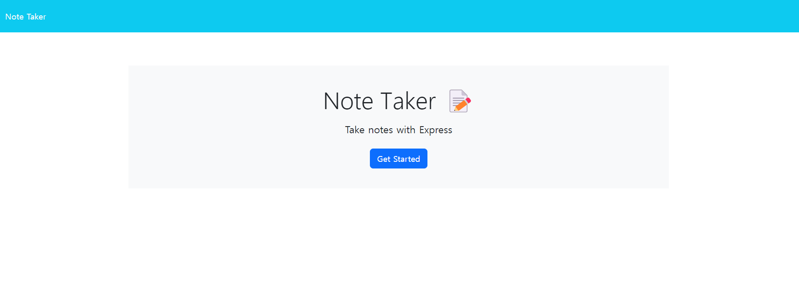
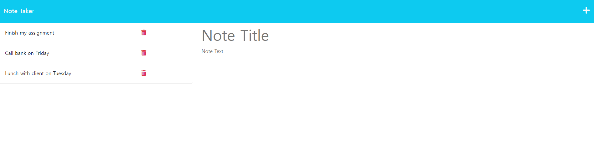
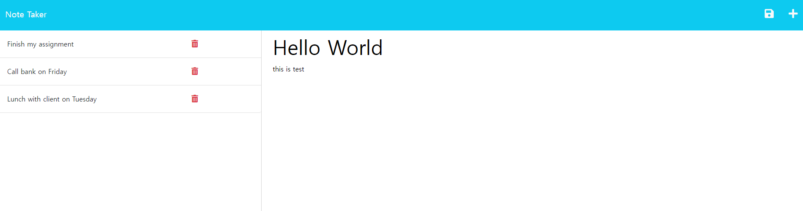

# Note Taker

## Description
This project is geneterated to create an application called Note Taker that can be used to write and save notes. 
Note Taker is a web-based application that allows users to efficiently create and manage notes. 
With this application, users can write and save notes, as well as edit or delete them when needed.

## Key Features

- Note Creation: Write new notes by entering a title and content.
- Note Deletion: Organize your notes by removing ones that are no longer necessary.
- Note Listing: View a list of all your created notes.

## Tech Stack

- Front-end: HTML, CSS, JavaScript
- Back-end: Node.js, Express.js
- Data Storage: JSON file (db.json)

## Installation and Running

1. Clone the repository or download the code.
2. Navigate to the project folder and run the following command to install the required packages: ```npm install```
3. Start the server with the following command: ```npm run start```
4. Access the application by opening a web browser and visiting `http://localhost:3001`.


## Screenshot





## Heroku Link
[**https://pacific-wave-09636-daa9aa6b0f69.herokuapp.com**](https://pacific-wave-09636-daa9aa6b0f69.herokuapp.com)
